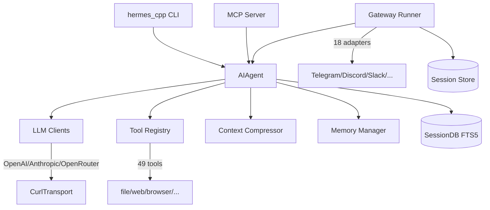
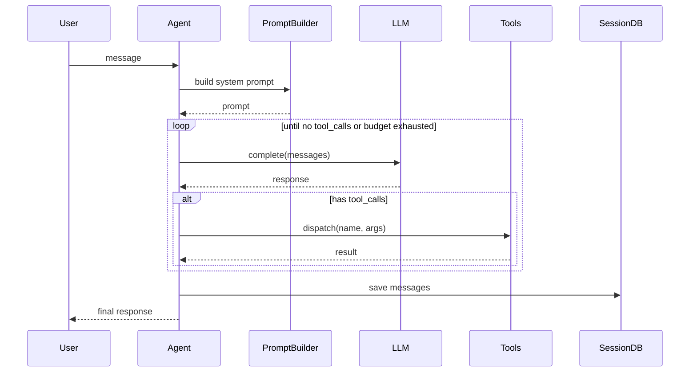
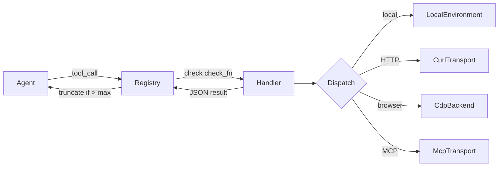
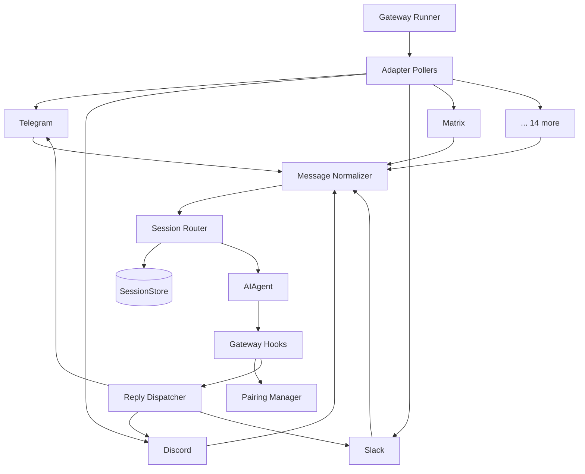
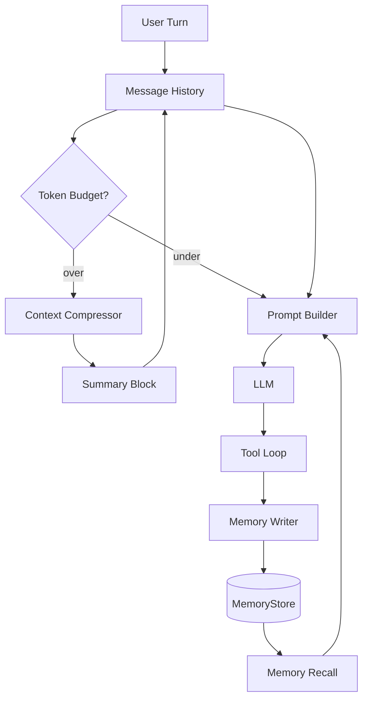
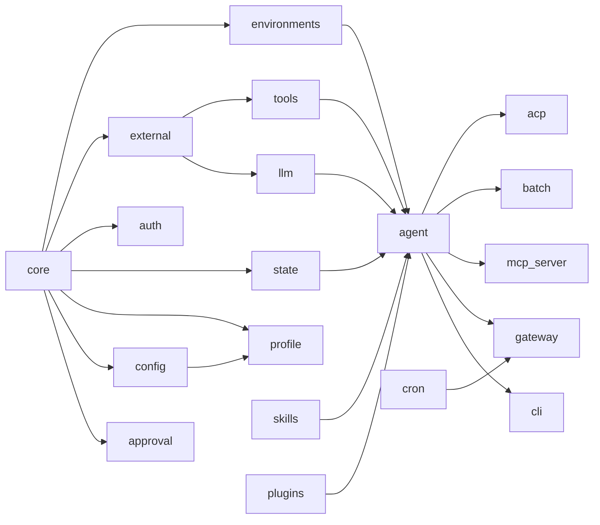

# Hermes Agent C++ Architecture

This document describes the C++17 backend architecture of Hermes Agent using
Mermaid diagrams. All components listed below live under `cpp/` and are built
by the top-level `cpp/CMakeLists.txt`.

## Component Overview

## Agent Loop Sequence

## Tool Dispatch

## Gateway Architecture

## Memory and Context Flow

## Build Dependency Graph

See also `module-dependency.md` for a text listing of each library target and
its direct CMake link dependencies.
